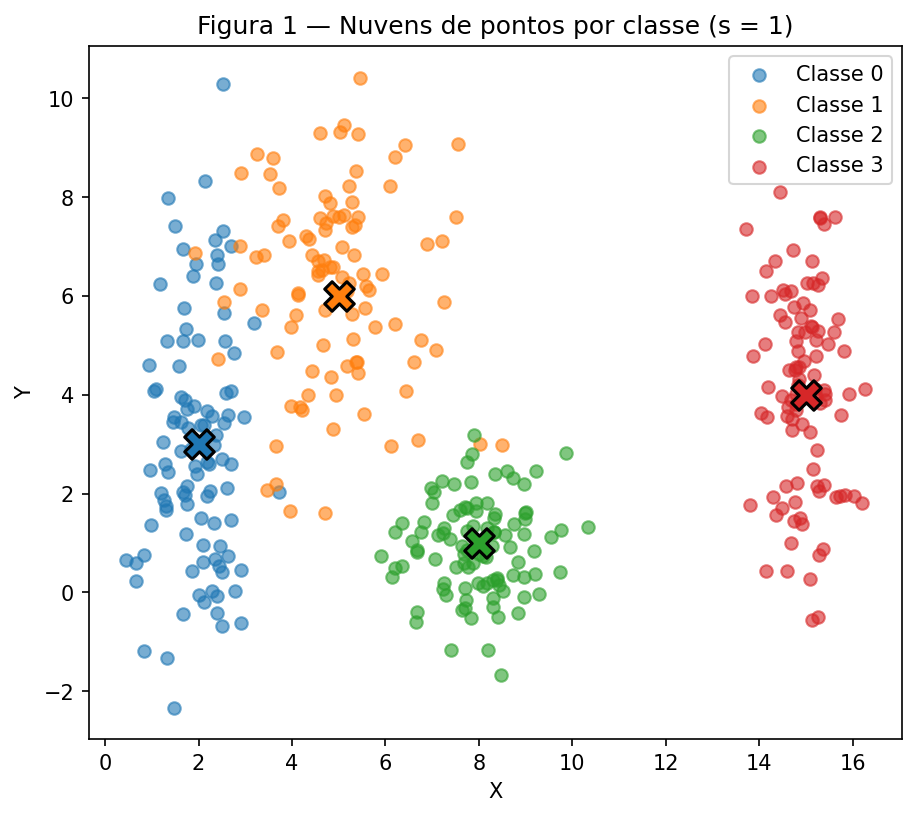
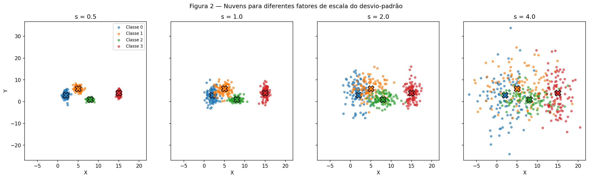
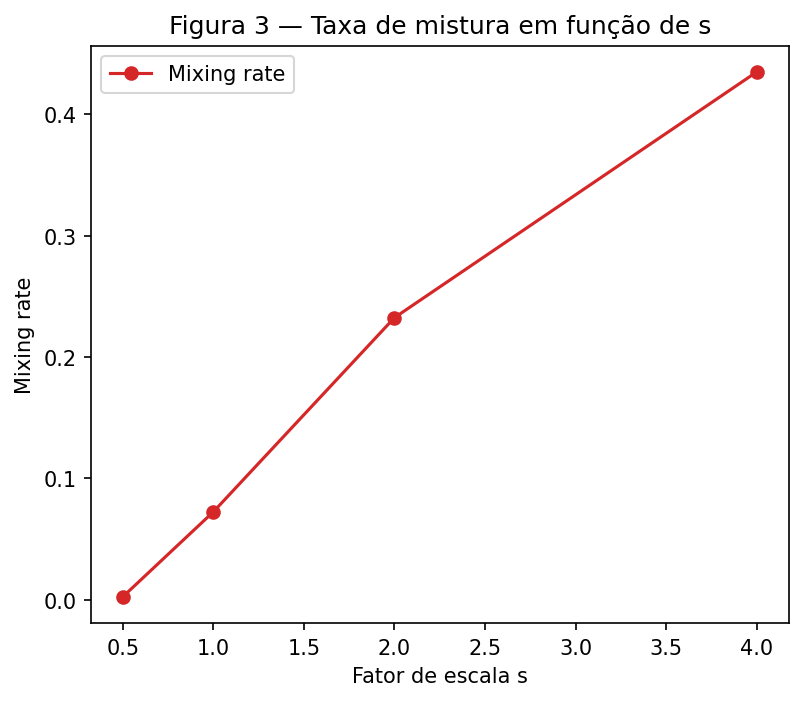
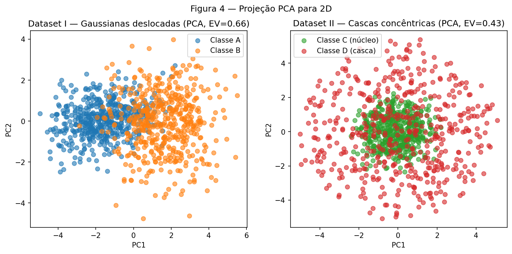
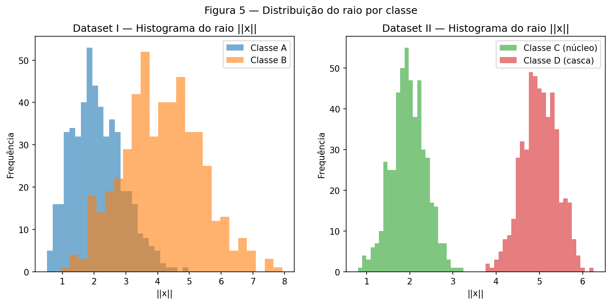
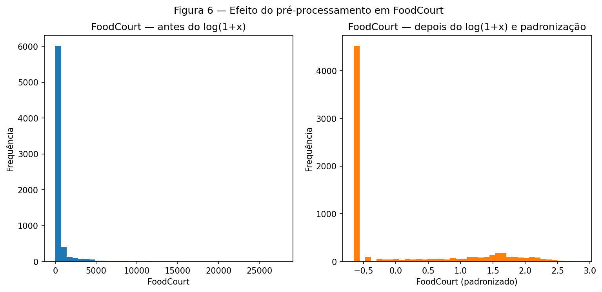

# 1. Data

## Exercise 1

### Abordagem

Geramos 400 pontos em 2D, 100 por classe, com `np.random.default_rng(42)` fixado uma
única vez no topo do script e reutilizado em todas as chamadas (item A). No item B, o
mesmo `rng` é usado para gerar 4 versões do dataset com os desvios-padrão multiplicados
por `s ∈ {0.5, 1.0, 2.0, 4.0}`, mantendo as médias fixas. A separação entre classes é
medida de duas formas: analiticamente, pelo *separation ratio* `r_ij` entre cada par de
centros; e empiricamente, pela *mixing rate* (fração de pontos mais próximos do centro
errado).

### Código

O script vive em [`code/exercise1_point_clouds.py`](https://github.com/julia-campos-ma/ANN-DL/blob/main/docs/exercises/data/code/exercise1_point_clouds.py)
e é incluído aqui pelo próprio arquivo.

``` { .python .copy .select linenums='1' title="docs/exercises/data/code/exercise1_point_clouds.py" }
--8<-- "docs/exercises/data/code/exercise1_point_clouds.py"
```

1.  Semente fixa: sem ela, os números da tabela de resultados mudam a cada execução.
2.  `plt.close(fig)` evita o vazamento de figuras entre as três chamadas de plot do script.

### Figuras


/// caption
**Figura 1** — Dispersão das quatro classes no plano $(x, y)$ com `s = 1.0`, centros
marcados com X.
///


/// caption
**Figura 2** — As mesmas 4 classes, com o desvio-padrão multiplicado por
`s ∈ {0.5, 1.0, 2.0, 4.0}`. Eixos compartilhados entre os 4 subplots.
///


/// caption
**Figura 3** — Fração de pontos mais próximos do centro de uma classe diferente da sua,
em função de `s`.
///

### Análise

**Separation ratio (`s = 1`):**

| Par de classes | $r_{ij}$ |
|---|---|
| (0, 1) | 1.326 |
| (0, 2) | 2.480 |
| (0, 3) | 4.496 |
| (1, 2) | 2.380 |
| (1, 3) | 3.642 |
| (2, 3) | 3.542 |

O menor valor é o par **(0, 1)**, com $r_{ij} = 1.326$. Como as médias não mudam com a
escala, $r_{ij}$ é proporcional a $1/s$: em $s = 2$, esse mesmo par teria
$r_{ij} = 1.326 / 2 = 0.663$.

Em `s = 1`, o único par com sobreposição visível na Figura 1 é justamente (0, 1) — as
classes 0 e 2 e a classe 3 já ficam bem isoladas. **Um único hiperplano linear não separa
as 4 classes simultaneamente** (o problema é multiclasse e as classes não estão
alinhadas ao longo de uma única direção), mas um **conjunto** de fronteiras lineares
(uma por par adjacente, como um classificador one-vs-one/one-vs-rest) resolveria bem o
caso `s = 1`, dado que a mixing rate nesse ponto é de apenas 7.2%.

A mixing rate cresce de forma acelerada com `s` — 0.3% (`s=0.5`) → 7.2% (`s=1.0`) →
23.3% (`s=2.0`) → 43.5% (`s=4.0`). A partir de aproximadamente **`s = 2`**, a mixing
rate ultrapassa 20% e o par (0, 1) já tem $r_{ij} < 1$ (fronteira teoricamente cruzando
a região de maior densidade de ambas as classes) — esse é o ponto em que fronteiras
lineares deixam de dar conta do problema com um erro aceitável.

Esboçando fronteiras sobre a Figura 1: uma rede treinada tenderia a aprender uma
fronteira quase vertical entre as classes 0 e 1 (a região de maior sobreposição), e
fronteiras bem afastadas dos pontos entre as classes 0–2, 1–2 e qualquer par envolvendo
a classe 3 (isolada à direita). Conforme `s` cresce (Figura 2), essas fronteiras não
mudam de *posição* (as médias são fixas), mas a região de erro inevitável ao redor delas
cresce proporcionalmente à área de sobreposição das caudas gaussianas — exatamente o
que a Figura 3 quantifica.

## Exercise 2

### Abordagem

O Dataset I usa `rng.multivariate_normal` para gerar duas gaussianas 5D correlacionadas
(matrizes de covariância com termos fora da diagonal). O Dataset II usa uma construção
geométrica: amostra-se uma direção uniforme na esfera unitária de $\mathbb{R}^5$
(normalizando um vetor gaussiano) e multiplica-se por um raio aleatório — `ρ ~ N(2, 0.4)`
para o núcleo, `ρ ~ N(5, 0.4)` para a casca. Ambos os datasets são projetados para 2D via
PCA para visualização, mas as métricas de distância e raio são sempre calculadas nas 5
dimensões originais.

### Código

``` { .python .copy .select linenums='1' title="docs/exercises/data/code/exercise2_nonlinearity.py" }
--8<-- "docs/exercises/data/code/exercise2_nonlinearity.py"
```

1.  `rho[:, None]` adiciona uma dimensão para o broadcasting funcionar: `(500,)` vira
    `(500, 1)`, multiplicando cada linha do vetor direção `(500, 5)` pelo raio escalar
    correspondente.
2.  `plt.close(fig)` evita acumular figuras abertas em memória entre as duas chamadas de
    plot do script.

### Figuras


/// caption
**Figura 4** — Projeção em 2D via PCA. Dataset I (esquerda) e Dataset II (direita).
///


/// caption
**Figura 5** — Distribuição do raio $\lVert x \rVert$ de cada classe, calculada nas 5
dimensões originais.
///

### Análise

- Distância entre centros — Dataset I: **3.228**
- Distância entre centros — Dataset II: **0.266**
- Variância explicada (PC1+PC2) — Dataset I: **0.660**
- Variância explicada (PC1+PC2) — Dataset II: **0.429**

No Dataset II a distância entre os centros das classes C e D é praticamente zero
(0.266), enquanto os histogramas de raio (Figura 5) mostram as duas classes quase
totalmente separadas — uma em torno de $\lVert x \rVert \approx 2$, a outra em torno de
$\lVert x \rVert \approx 5$. Essa combinação (centros coincidentes + raios separados)
mostra que **nenhum hiperplano pode separar as classes**: um hiperplano é definido por
uma direção e um deslocamento fixos ($\mathbf{w}^\top \mathbf{x} + b = 0$), mas aqui a
classe de um ponto não depende da *direção* em que ele está (por construção, as direções
são uniformes para as duas classes) — depende só da sua *distância à origem*. Como os
centros coincidem, qualquer hiperplano deixaria aproximadamente metade dos pontos de
cada classe de cada lado.

Por isso a estrutura do Dataset II não pode ser resolvida por uma fronteira linear **por
mais dados que se colete**: o problema não é falta de amostras, é que a informação
relevante (o raio) não é uma função linear das coordenadas cartesianas $x_1, ..., x_5$.

O fato de a projeção 2D do Dataset II (Figura 4, direita) parecer misturada **não prova
que as classes sejam inseparáveis** no espaço original — PCA é uma transformação linear,
e só preserva bem a separação quando ela já é aproximadamente linear nas direções de
maior variância. A prova concreta disso é a Figura 5: no espaço 5D original existe sim
uma função simples que separa quase perfeitamente as duas classes,

$$
f(\mathbf{x}) = \lVert \mathbf{x} \rVert^2 = \sum_{i=1}^{5} x_i^2,
$$

que é justamente o quadrado do raio usado para gerar os dados — não-linear nas
coordenadas originais, mas trivial de calcular.

## Exercise 3

### Abordagem

Usamos o dataset [Spaceship Titanic](https://www.kaggle.com/competitions/spaceship-titanic)
(`train.csv`, ~8700 linhas). O split treino/teste (80/20, estratificado, semente fixa)
acontece **antes** de qualquer imputação, encoding ou escalonamento, para evitar data
leakage. As colunas numéricas usam imputação pela mediana; as categóricas, pela moda.
`HomePlanet`, `CryoSleep`, `Destination` e `VIP` são convertidas via one-hot encoding com
`handle_unknown="ignore"`. Criamos `TotalSpend` (soma das 5 colunas de gasto), aplicamos
`log(1+x)` nas colunas de gasto (heavy-tailed) e padronizamos (`StandardScaler`) todas as
colunas numéricas.

### Código

``` { .python .copy .select linenums='1' title="docs/exercises/data/code/exercise3_preprocessing.py" }
--8<-- "docs/exercises/data/code/exercise3_preprocessing.py"
```

1.  Guardamos uma cópia de `FoodCourt` antes do `log1p` só para poder plotar o
    antes/depois na Figura 6 — ela não entra em nenhum cálculo do modelo.
2.  `plt.close(fig)` libera a figura depois de salva.

### Figuras


/// caption
**Figura 6** — Distribuição de `FoodCourt` no treino, antes do `log(1+x)` e depois do
`log(1+x)` seguido de padronização.
///

### Análise

**Objetivo e balanço do target:** `Transported` indica se o passageiro foi transportado
para outra dimensão. O balanço é praticamente 50/50 (50.4% `True` / 49.6% `False`), sem
desbalanceamento relevante.

**Tipos de feature:** numéricas — `Age`, `RoomService`, `FoodCourt`, `ShoppingMall`,
`Spa`, `VRDeck`; categóricas — `HomePlanet`, `CryoSleep`, `Destination`, `VIP`. (`Cabin`,
`Name` e `PassengerId` são descartadas na engenharia de features.)

**Missing values:** todas as colunas têm entre 2.06% e 2.50% de valores ausentes,
espalhados de forma bastante uniforme — não há uma coluna dominando os missings.

**Mean × median dos gastos:** em todas as 5 colunas a mediana é **0** (a maioria dos
passageiros não gasta naquela amenidade), enquanto a média é bem maior que zero e o
máximo é ordens de magnitude maior ainda (ex.: `FoodCourt` — média 458.08, mediana 0,
máximo 29 813). Isso indica uma distribuição fortemente assimétrica à direita, com poucos
passageiros gastando muito — exatamente o padrão que motiva o `log(1+x)`.

**Por que o split vem antes da transformação:** se a mediana, a média/desvio ou as
categorias mais frequentes fossem calculadas no dataset inteiro, o conjunto de teste
"vazaria" informação estatística para o pré-processamento antes de o modelo ser avaliado
nele — a performance reportada ficaria artificialmente otimista.

**`log(1+x)` e `tanh`:** `tanh` satura para entradas grandes em módulo (gradiente ≈ 0).
Sem o log, os poucos valores extremos de gasto dominariam a escala e a rede aprenderia
pouco com a maioria dos exemplos, que gastam perto de zero. O log comprime a cauda e deixa
a distribuição bem mais compacta (Figura 6).

**Verificações finais:** 0 valores `NaN` em treino e teste após o pré-processamento;
shape final do treino (6954, 17); faixa de valores após a padronização — treino
[-2.006, 3.493], teste [-2.006, 3.214] — compatível com a região não totalmente saturada
de `tanh`.

**Reflexão:** dentre as decisões de pré-processamento, o `log(1+x)` nas colunas de gasto
provavelmente é a que mais afeta o treino: sem ele, os valores extremos (até ~30 mil)
dominariam a escala mesmo depois da padronização, fazendo com que a rede dedicasse a
maior parte do seu gradiente inicial a poucos exemplos atípicos em vez de aprender o
padrão geral presente na maioria dos passageiros.

## Results summary

| # | Item | Valor |
|---|------|-------|
| 1 | Mixing rate em `s = 0.5` | 0.003 |
| 2 | Mixing rate em `s = 1.0` | 0.072 |
| 3 | Mixing rate em `s = 2.0` | 0.233 |
| 4 | Mixing rate em `s = 4.0` | 0.435 |
| 5 | Menor $r_{ij}$ em `s = 1.0`, e qual par | 1.326 — par (0, 1) |
| 6 | Distância entre centros — Dataset I | 3.228 |
| 7 | Distância entre centros — Dataset II | 0.266 |
| 8 | Variância explicada PC1+PC2 — Dataset I | 0.660 |
| 9 | Variância explicada PC1+PC2 — Dataset II | 0.429 |
| 10 | Fração da classe positiva em `Transported` | 0.504 |
| 11 | Média e mediana de `FoodCourt` no treino, antes da transformação | média 458.08 / mediana 0.0 |
| 12 | Shape final da matriz de features de treino | (6954, 17) |
| 13 | Mínimo e máximo de treino e teste após a escala | treino [-2.006, 3.493] / teste [-2.006, 3.214] |
